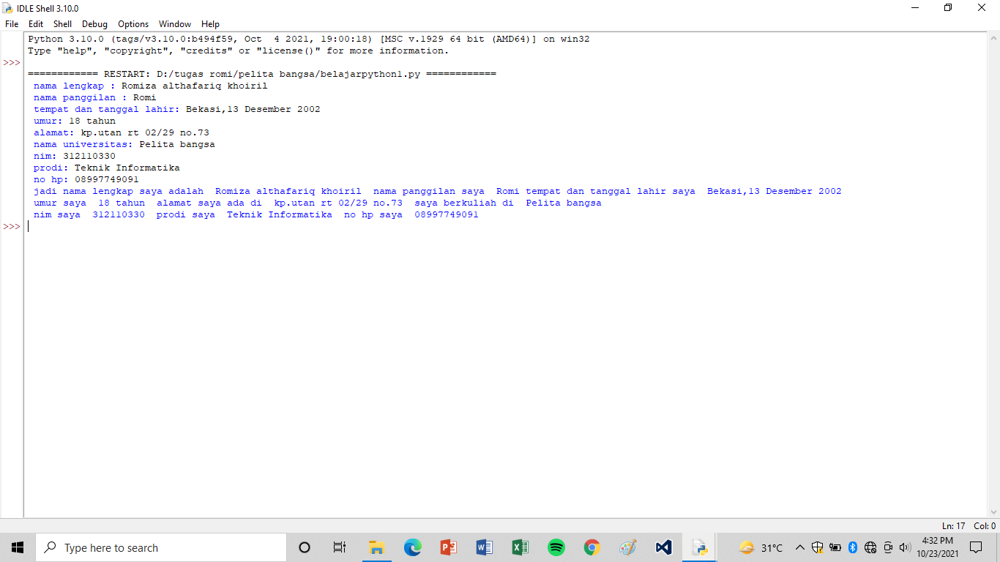

# belajarpython
## Belajar input dan output data pada python

### Cara Memasukan Input
contoh :
nama = input ("Siapakah Nama Kamu :",nama)
- Nah untuk cara memasukan inputan caranya seperti contoh di atas.
- jadi  "nama = input" adalah variabel yang akan kita masukan/inputkan data nantinya di console
- Karna yang akan ditampilkan diconsole itu data bertype string, harus selalu menggunakan tanda kurung dan dilanjutkan dengan tanda petik dua di dalamnnya, jangan lupa pula setiap ingin menambahkan data dilanjutkan dengan tanda koma setelahnnya. nah sedangkan kata "nama" setelah tanda koma yang berada didalam kurung, itu dia adalah variabel yang akan kita input di console nantinya.

### Cara Mengeluarkan Otput dari Data yang Kita Input
contoh :
print = ("Jadi Nama Kamu Adalah",nama)
- Nah untuk cara mengeluarkan output dari data yang kita inputkan, caranya seperti contoh di atas.
- jadi untuk menampilkan data yang kita inputkan di atas caranya di awali dengan "print" artinya dia akan menampilkan data yang ingin kita tampilkan. 
- sama halnya seperti yang di atas apabila data yang kita ingin print itu bertype string, selalu di awali dengan tanda kurung, dilanjutkan tanda petik dua didalamnya. karna kita juga akan menampilkan data yang kita input kita masukan juga variable "nama" dengan di awali tanda koma sebelumnya.

### Contoh Gambaran Output yang sudah Saya Program 
